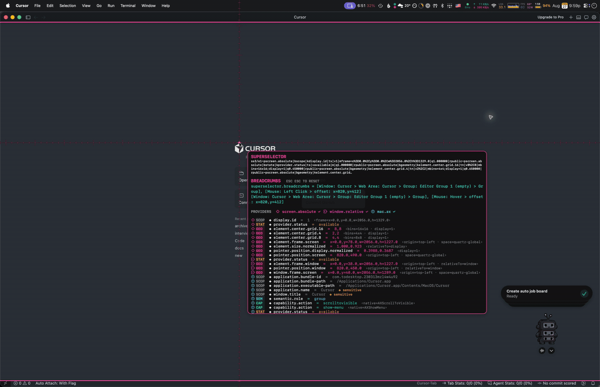
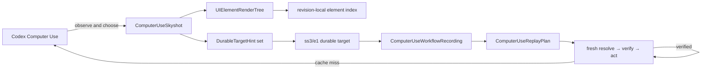
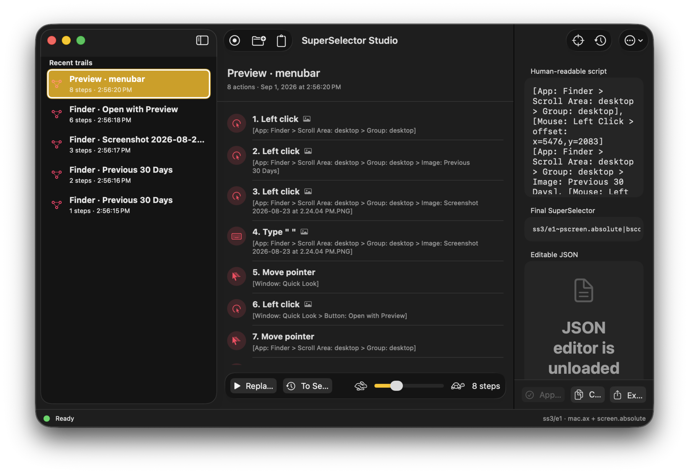
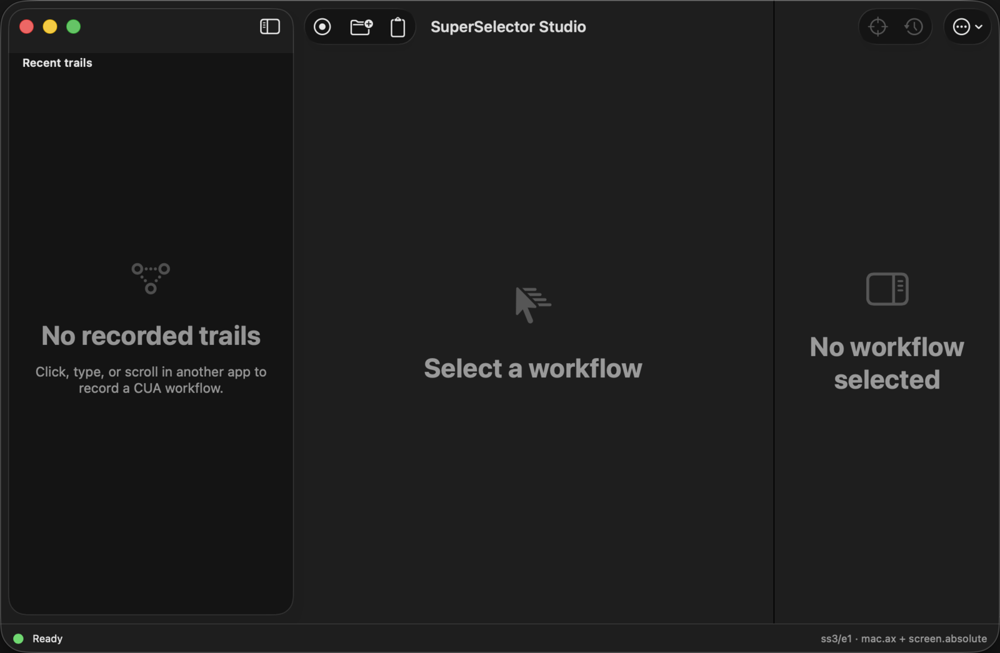
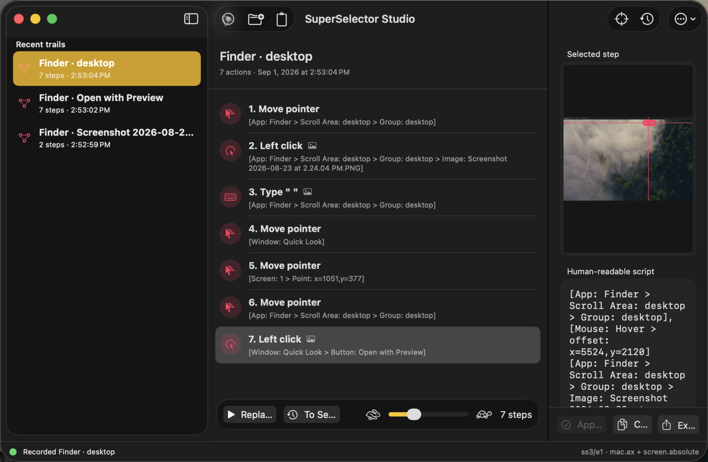
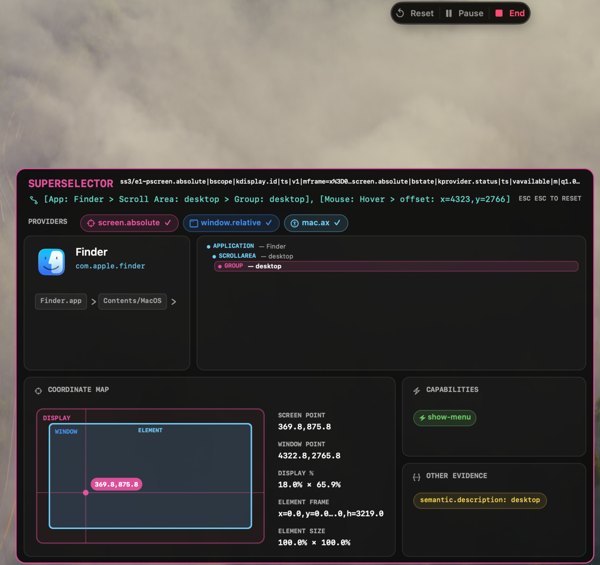
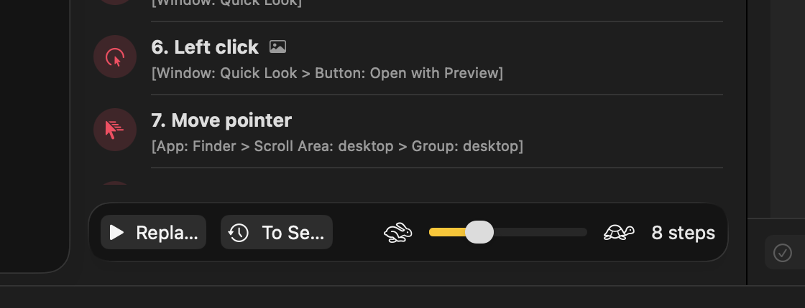
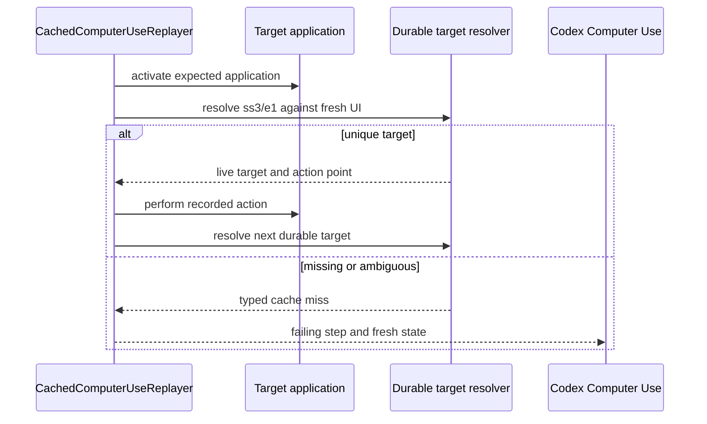

# SuperSelector Studio for Codex Computer Use



SuperSelector Studio gives computer-use agents durable targets and cacheable action sequences for arbitrary macOS interfaces.

For the system-level context behind these concepts, read [Inside Codex Computer Use and Sky: an architecture deep dive](https://docs.monadical.com/s/codex-sky-deep-dive).

A Computer Use element index is an excellent address inside one captured UI tree. It is not an identity that can safely survive another capture, a window rearrangement, an application restart, or a different machine. A SuperSelector preserves provider-attributed evidence about a target so the corresponding element can be found again.

The result is a two-speed execution model:

1. Codex Computer Use observes and reasons when a workflow is unfamiliar or the UI has changed.
2. SuperSelector Studio records durable targets and actions while keeping their screenshots and agent-facing trees together.
3. A recording can run as a deterministic fast path without another model decision between every action.
4. Target ambiguity stops cached execution; the integration contract returns that cache miss to the ordinary Computer Use loop.

> **Download the latest [`SuperSelector.app`](https://github.com/pirate/cua-superselector/releases).**


## The data model

SuperSelector uses separate types for evidence with different lifetimes. Snapshot-local addresses never leak into durable identity.

| Concept | Swift type | Lifetime | Purpose |
| --- | --- | --- | --- |
| Skyshot | `ComputerUseSkyshot` | One observation | Combines capture context, provider evidence, durable target, and agent tree |
| Capture context | `ComputerUseCaptureContext` | One observation | Timestamp, pointer, display, trust state, and target AX snapshot |
| AX node | `AccessibilityNode` | One tree revision | Agent-visible role, name, state, actions, frame, and element index |
| Agent tree | `UIElementRenderTree` | One tree revision | Indexed hierarchy rendered in `AppState.text`-compatible form |
| Durable evidence | `DurableTargetHint` | Shareable | Provider-attributed semantic, structural, content, state, and geometry evidence |
| Provider state | `CaptureProviderReport` | One observation | Whether an evidence source is available, degraded, or unavailable |
| Workflow library | `ComputerUseWorkflowLibrary` | Persistent | Versioned collection of recordings and screenshot assets |
| Workflow recording | `ComputerUseWorkflowRecording` | Persistent/shareable | Ordered steps, final target, provenance, and Computer Use contract |
| Workflow step | `ComputerUseWorkflowStep` | Persistent/shareable | Target, action, screenshot geometry, and captured agent tree |
| Recorded action | `ComputerUseRecordedAction` | Persistent/shareable | Click, scroll, text, key, or hover input data |
| Replay plan | `ComputerUseReplayPlan` | One execution | Full reset replay or a cached action subsequence |



### Skyshots and agent trees

A `ComputerUseSkyshot` represents one observation of the desktop. It contains:

- the `ComputerUseCaptureContext`;
- one `CaptureProviderReport` per evidence source;
- the complete set of `DurableTargetHint` values;
- the encoded `ss3/e1` target;
- a bounded `UIElementRenderTree`; and
- the target node highlighted within that tree revision.

The render tree assigns a temporary `elementIndex` to each `AccessibilityNode`. Studio renders it using the same basic grammar agents receive in `AppState.text`: an application/window header, indexed and indented roles, names and values, disabled or selected state, secondary actions, and the focused-element summary.

```text
Window: "Preferences", App: Example.
0 group Settings
	1 text field Search
	2 group General
		3 checkbox Launch at Login (selected)
		4 button Save

The focused UI element is 1 text field Search
```

The index `4` is meaningful only for that exact tree revision. A recording stores the target's SuperSelector, not `4`.

Studio derives this compatible rendering from the application's macOS Accessibility hierarchy. An external Computer Use bridge can ingest the authoritative `AppState.text` and screenshot seen by Codex; private Sky service IPC is not part of the persistence format.

### Durable target evidence

A SuperSelector can combine evidence from every layer available to the driver:

- screen and display geometry;
- macOS Accessibility roles, labels, identifiers, values, actions, and ancestry;
- OCR text and bounds;
- visual landmarks or image features;
- browser viewport and document geometry;
- CSS, XPath, DOM, and browser accessibility properties; and
- framework- or application-specific identifiers.

One target may produce evidence like:

```text
[screen.absolute] pointer.position.screen = 1432.0,811.0
[screen.absolute] element.frame.screen = x=1391.0,y=790.0,w=92.0,h=32.0
[mac.ax] application.bundle-id = com.apple.Safari
[mac.ax] semantic.role = button
[mac.ax] semantic.name = Continue
[mac.ax] capability.action = invoke  {native=AXPress}
[mac.ax] ancestor.role-path = application>window>group
[browser.viewport] element.frame = x=804,y=612,w=92,h=32
[browser.css] selector = button[data-action="continue"]
[ocr] text = Continue  {confidence=0.99}
```

Every evidence field names its provider, category, kind, value type, metadata, quality, and privacy classification. Providers remain independent: a native app might expose only screen and AX evidence, while a browser can add DOM and viewport evidence and a remote desktop might supply only image, OCR, and coordinates.

The compact representation is lossless:

```text
ss3/e1~pscreen.absolute|bgeometry|kpointer.position.screen|tn|v1432.0%2C811.0|morigin=top-left;space=quartz-global|q1.000000|rpublic~...
```

`ss3/e1` identifies the selector and encoding version. Each following field independently preserves:

- provider and evidence band;
- evidence kind;
- scalar (`tn`) or text (`ts`) value type;
- escaped value and sorted metadata;
- provider-reported quality; and
- privacy classification.

Runtime handles are excluded from durable identity. AX object references, process IDs, Windows HWNDs and UIA RuntimeIds, CDP node IDs, and Computer Use element indexes belong only to live resolution state.

## Capture providers

Capture providers describe the same target from different layers.

| Provider | Layer | Example evidence | Availability |
| --- | --- | --- | --- |
| `screen.absolute` | Display server | Pointer, display ID, target frame, normalized geometry | Implemented |
| `mac.ax` | macOS Accessibility | App/window identity, roles, labels, values, actions, state, ancestry | Implemented |
| `windows.uia` | Windows UI Automation | Control type, AutomationId, name, patterns, bounding rectangle | Planned |
| `ocr` | Screenshot | Text spans, language, confidence, bounding polygons | Planned |
| `visual` | Screenshot | Icons, region features, edges, color, nearby landmarks | Planned |
| `browser.viewport` | Browser view | Viewport coordinates and visible bounds | Planned |
| `browser.document` | Browser document | Document coordinates, scrolling, frame ancestry | Planned |
| `browser.css` | DOM | Tag, attributes, classes, selector candidates | Planned |
| `browser.xpath` | DOM | Structural paths and nearby context | Planned |
| `browser.ax` | Browser Accessibility | Roles, names, properties, and relationships | Planned |
| `electron.*` | Application runtime | Renderer and application-specific identity | Planned |

Providers implement `ComputerUseCaptureProvider`:

```swift
protocol ComputerUseCaptureProvider {
  var id: String { get }
  func report(for scene: ComputerUseCaptureContext) -> CaptureProviderReport
  func hints(for scene: ComputerUseCaptureContext) -> [DurableTargetHint]
}
```

Provider IDs and evidence kinds are open strings. Unknown providers and fields survive encoding even when a particular resolver cannot interpret them.

## SuperSelector Studio

`SuperSelector.app` is a live macOS recorder, inspector, and replay debugger for Computer Use workflows.

As the pointer moves, the app:

- captures a `ComputerUseSkyshot` for the target under the pointer;
- outlines the target and draws display-relative crosshairs and rulers;
- displays the screenshot and `UIElementRenderTree` side by side;
- uses one `SuperSelectorBoxModel` for the live outline, screenshot annotation, tree highlight, and replay coordinates;
- shows provider availability and every durable evidence field;
- records clicks, scrolling, text, keys, and semantic target transitions as `ComputerUseWorkflowStep` values;
- keeps the 15 most recent exact selectors in newest-first order;
- copies a selector sampled at the exact click location; and
- resolves a pasted `ss3/e1` target for visual inspection without acting on it.

The overlay and status item are excluded from clean screenshots. The overlay also hides while its own menu is active so it does not become part of the target application state.

Open **SuperSelector Studio…** from the menu bar or press **Command-Shift-I**.

### Recording workspace

The three-column workspace keeps the workflow library, ordered actions, and selected-step evidence visible together. A selected step contains:

- its durable `ss3/e1` target;
- readable semantic target path;
- `ComputerUseRecordedAction` payload;
- clean screenshot asset;
- screen, window, target, and pointer geometry;
- bounded agent-tree text; and
- capture and action timestamps.

<p align="center">
  
</p>

<table>
  <tr>
    <td width="50%" valign="top">
      
      <br /><sub><b>Start a recording.</b> Interact with another application while Studio captures targets, actions, trees, and screenshots.</sub>
    </td>
    <td width="50%" valign="top">
      
      <br /><sub><b>Inspect a step.</b> The screenshot box and tree index identify the same target in the same Skyshot.</sub>
    </td>
  </tr>
  <tr>
    <td width="50%" valign="top">
      
      <br /><sub><b>Inspect live evidence.</b> Provider provenance, agent tree, target identity, state, actions, and geometry remain visible together.</sub>
    </td>
    <td width="50%" valign="top">
      
      <br /><sub><b>Execute deterministically.</b> Run from a normalized desktop, replay through a selected step, or execute a cached action range against the current UI.</sub>
    </td>
  </tr>
</table>

### Workflow storage

`ComputerUseWorkflowLibrary` uses JSON schema 2. Screenshot pixels live once in the top-level asset table; individual steps reference an asset and retain their exact capture geometry. This keeps recordings self-contained without embedding the same JPEG repeatedly.

Each `ComputerUseWorkflowRecording` carries a Computer Use bridge contract:

```json
{
  "format": "computer-use.workflow",
  "version": 1,
  "captureModel": "skyshot",
  "agentTree": "appstate.text",
  "durableTarget": "superselector.ss3/e1",
  "cachedExecution": "resolve-then-act",
  "cacheMiss": "return-to-computer-use"
}
```

Recordings can be copied as JSON or imported and exported as files. Persistent data lives under:

```text
~/Library/Application Support/SuperSelector/
  workflow-log.json
  screenshots/
  instance.lock
```

The application holds a single-writer lock for this directory. Launching a second copy activates the existing instance instead of creating competing writers.

## Resolution

Resolution compares a durable target with fresh UI evidence. It is deliberately asymmetric: generation preserves all evidence, while resolution can select the fastest safe strategy available for the target and action.

The macOS resolver:

1. scopes to a running application using stable bundle or executable identity;
2. scopes to the recorded window when a durable window identity exists;
3. checks direct focused-element or native-identifier paths;
4. traverses the smallest viable AX subtree;
5. filters candidates by exact application and role invariants;
6. scores native identity, names, values, ancestry, state, and actions;
7. requires both an acceptance threshold and an ambiguity margin; and
8. applies live geometry only after a position-independent target wins.

Coordinates never override a semantic mismatch. They are used as a last-resort target for screen-only recordings or to reconstruct the original relative click point inside a successfully resolved element.

### Matching strategies

The encoded evidence does not commit recordings to one ranking algorithm. Resolvers can combine:

- direct native identifier lookup;
- exact invariants and prefix comparison;
- lexical indexes over roles, attributes, labels, values, and ancestor paths;
- trigram, edge n-gram, BM25, or field-weighted retrieval;
- SimHash or MinHash for text and token sets;
- pHash, dHash, HOG, edge density, or color features for visual regions;
- deterministic feature vectors or learned embeddings;
- late fusion across independent providers; and
- application- or workflow-specific stability weights learned from replay outcomes.

Candidate retrieval and acceptance are separate. A target resolves only when its best candidate has enough absolute evidence, sufficient margin over the runner-up, and every risk-specific invariant required by the action. Low-information, tied, or contradictory results are cache misses.

## Cached execution

`CachedComputerUseReplayer` executes a `ComputerUseReplayPlan`. It skips model inference between verified actions but never skips target resolution.

Two plan modes are available:

- **Reset replay** hides regular applications, activates Finder, and executes from the beginning through a chosen step.
- **Cached subsequence** starts at a marked step and executes through the selected ending step against the current desktop state.

Every action follows the same safety boundary:



Target resolution is AX-first. The local executor performs the recorded keyboard or pointer input only after resolving a unique live target. Sensitive or externally consequential actions remain subject to Computer Use approvals; cached execution is not an approval bypass.

## Codex Computer Use integration

[Codex Computer Use](https://learn.chatgpt.com/docs/computer-use) is the observation-and-action system for GUI work when command-line tools or structured integrations are insufficient. SuperSelector supplies a durable target and deterministic execution layer beneath that reasoning loop.

[Record & Replay](https://learn.chatgpt.com/docs/extend/record-and-replay) turns a demonstrated workflow into a reusable skill that can use Computer Use, browser actions, plugins, or a combination. A SuperSelector recording is the lower-level execution artifact for steps whose targets and expected transitions can be resolved and verified without another model decision.

The integration boundary is a local plugin containing a small MCP server and skill:

```text
structured connector or application API
  → verified cached SuperSelector recording
    → ordinary Codex Computer Use loop
```

The bridge surface is intentionally workflow-oriented:

| Tool | Responsibility |
| --- | --- |
| `list_workflow_recordings` | Return recording IDs, applications, steps, inputs, and verification age |
| `get_workflow_recording` | Return the readable plan, input contract, checks, and redacted evidence |
| `resolve_target` | Resolve a durable target and explain confidence and ambiguity |
| `verify_workflow` | Dry-resolve every target without performing actions |
| `run_cached_subsequence` | Execute verified steps and stop at the first cache miss or policy boundary |
| `ingest_app_state` | Associate authoritative Computer Use tree text and screenshot with a Skyshot |
| `export_workflow` / `import_workflow` | Share a portable, content-addressed recording |

Authoritative Computer Use state ingestion accepts:

```ts
type AppState = {
  app: string
  screenshot: { url: string } | null
  text: string
}
```

The bridge correlates the agent's chosen element index with the same capture's AX and screenshot evidence, generates a durable SuperSelector, and discards the index when that tree revision expires.

See [Codex Computer Use integration](docs/codex-computer-use-integration.md) for the package boundary, verification contract, sharing format, and implementation roadmap.

## Build and run

Requirements:

- macOS 14 or later;
- Xcode Command Line Tools; and
- Swift 6.

```bash
./scripts/build-app.sh
open SuperSelector.app
```

The build script uses the first available **Apple Development** signing identity. To choose one explicitly:

```bash
SUPERSELECTOR_SIGNING_IDENTITY='Apple Development: Your Name (TEAMID)' \
  ./scripts/build-app.sh
```

A stable signature allows macOS to retain Accessibility authorization across rebuilds. On first launch, grant access under **System Settings → Privacy & Security → Accessibility**, then quit and reopen the app if the overlay does not appear.

Disposable ad-hoc builds are available for development:

```bash
SUPERSELECTOR_ALLOW_ADHOC=1 ./scripts/build-app.sh
```

Ad-hoc rebuilds commonly require a fresh Accessibility grant.

Run the test suite with:

```bash
swift test
```

## Implementation status

The macOS application implements:

- `screen.absolute` and `mac.ax` capture providers;
- `ComputerUseSkyshot` capture and inspection;
- bounded `UIElementRenderTree` rendering;
- shared screenshot, target, pointer, and display geometry;
- lossless `ss3/e1` encoding;
- persistent `ComputerUseWorkflowLibrary` storage;
- action-by-action screenshots and agent-tree evidence;
- AX-first durable target resolution;
- full reset replay, replay through a selected step, and cached subsequences; and
- JSON clipboard and file import/export.

OCR, visual, Windows UIA, browser, framework-specific capture providers, authoritative `AppState` ingestion, postcondition fingerprints, and the local MCP/skill package are defined extension points.
