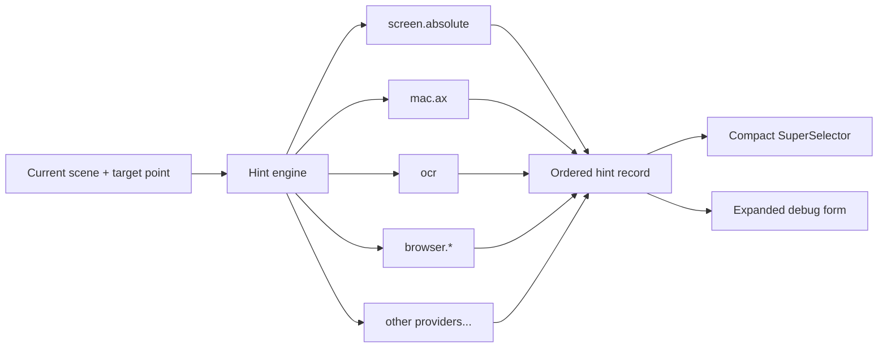

# Cache-able "SuperSelectors" for Computer Use Agents

`SuperSelectors` are my attempt at giving CUA systems one cachable "visual element selector" string that can carry hints from any source the driver has access to.

Think of it as a fuzzy `xpath` or CSS selector, but for arbitrary things on your screen, not only DOM elements.

> **⬇️ Download the latest <a href="https://github.com/pirate/cua-superselector/releases"><code>SuperSelector.app</code><a/> here.**


`SuperSelector.app` is a small macOS app for inspecting the SuperSelector generated for whatever is under your cursor.


During a normal computer-use loop, a driver usually has several ways to reference a UI element:

- its x,y bounding box on the screen
- its role, label, value, and actions in the OS accessibility tree
- text and edge bounds from OCR
- visual features (computer vision)
- viewport and document-relative CSS box coordinates (when in a browser)
- CSS, XPath, DOM attributes, and the browser accessibility tree
- framework- or app-specific identifiers from Electron, Qt, or other UI frameworks

A **SuperSelector** collects all of these hints into one provider-attributed description of the element as it appeared in a particular screen, view, or scene.

For example, one element might produce:

```text
[screen.absolute] pointer.position.screen = 1432.0,811.0
[screen.absolute] element.frame.screen = x=1391.0,y=790.0,w=92.0,h=32.0
[mac.ax] application.bundle-id = com.apple.Safari
[mac.ax] semantic.role = button
[mac.ax] semantic.name = Continue
[mac.ax] capability.action = invoke  {native=AXPress}
[mac.ax] ancestor.role-path = application>window>group
[browser.viewport] element.frame = x=804,y=612,w=92,h=32
[browser.css] selector = button[data-action="continue"]
[ocr] text = Continue  {confidence=0.99}
```

The available hints depend on the scene. A native macOS app may have screen and AX hints. A web page may add browser hints. A remote desktop or game may only expose coordinates, OCR, and visual features. Providers can be added independently, and every provider says where each hint came from.

---

## How it works

The hint engine runs alongside the CUA loop:

1. The driver captures the current scene and target point.
2. Each registered provider reports whether it is available, degraded, or unavailable.
3. Available providers inspect the scene and emit namespaced hints.
4. The engine sorts the hints into a stable order.
5. Every hint is encoded losslessly into its own typed field in the final SuperSelector string.
6. The expanded observation stays available for debugging and future resolution.



The current compact format looks like this:

```text
ss3/e1~pscreen.absolute|bgeometry|kpointer.position.screen|tn|v1432.0%2C811.0|morigin=top-left;space=quartz-global|q1.000000|rpublic~...
```

`ss3/e1` identifies the selector and encoding version. Every following field contains:

- the exact provider, band, and hint kind;
- an explicit scalar (`tn`) or text (`ts`) type;
- the exact escaped value and sorted metadata;
- the provider-reported quality and privacy classification.

The provider data remains available in the encoded string. Nearby scalar values retain their textual prefixes, and text stays available to whatever prefix or fuzzy comparison the resolver chooses. Every emitted hint contributes a field. Moving the pointer by a pixel changes the relevant coordinate characters.

## Hint providers

Providers are organized by the layer they can inspect. Several providers can describe the same element at once.

| Provider | Layer | Example hints | Status |
| --- | --- | --- | --- |
| `screen.absolute` | Display server | pointer position, display ID, element frame, normalized geometry | Implemented |
| `mac.ax` | macOS Accessibility | application, role, label, value, actions, state, ancestor roles | Implemented |
| `windows.ax` | Windows UI Automation | control type, AutomationId, name, patterns, bounding rectangle | Planned |
| `ocr` | Screenshot | text spans, language, confidence, bounding polygons | Planned |
| `visual` | Screenshot | icons, region features, color, nearby visual landmarks | Planned |
| `browser.viewport` | Browser view | viewport-relative coordinates and visible bounds | Planned |
| `browser.document` | Browser document | document coordinates, scroll state, frame ancestry | Planned |
| `browser.css` | DOM | tag, attributes, classes, selector candidates | Planned |
| `browser.xpath` | DOM | structural paths and nearby document context | Planned |
| `browser.ax` | Browser accessibility | roles, names, properties, and tree relationships | Planned |
| `electron.*` | Application runtime | renderer, accessibility, and app-specific identifiers | Planned |

Provider IDs and hint kinds are strings, so the format has no fixed list of engines. A driver can register the providers supported by its environment and include application-specific providers when they expose useful information.

Provider status is also emitted as a hint. This makes the final observation say which sources were present at generation time. A later resolver can tell the difference between a missing value and a provider that was unavailable for the whole scene.


## Generation and fuzzy resolution

SuperSelector generation records the full durable provider output. Every emitted hint gets an exact field in the compact string. Runtime handles such as process IDs are not selector hints: they identify one launch, cannot be reused by parallel or later runs, and add no cache value.

Fuzzy matching happens later, when a resolver compares the stored observation with candidates from a new scene. The resolver can compare compatible hint types, apply provider-specific rules, require agreement across several independent sources, and decline ambiguous matches.

The resolver should be tuned to avoid false positives. A cache miss can trigger another inspection or a fresh model decision. A false cache hit can send an input event to the wrong element.

Keeping generation exact also leaves room for different resolution policies. A read-only hover action may tolerate a weaker match. A click on a destructive control can require strong agreement between semantic, structural, and geometric hints.

## `SuperSelector.app`

The app is a live view of the generation side on macOS. As the cursor moves, it:

- draws translucent pink crosshairs and ruler ticks on the current display;
- outlines the macOS Accessibility element under the cursor;
- runs the registered hint providers continuously;
- updates the final SuperSelector string;
- shows every expanded hint on its own line;
- labels each hint with its provider, category, value, metadata, and privacy class;
- shows the availability state of each provider;
- copies a fresh selector sampled at the exact click location whenever a click passes through to another app;
- keeps the 15 most recent exact selectors in a newest-first menu section, using exact-string deduplication only;
- provides **Resolve selector…** in the menu bar to paste an `ss3/e1` selector and temporarily pin its screen-provider crosshairs and outline.

The current app registers `screen.absolute` and `mac.ax`.

`screen.absolute` emits display and screen geometry. `mac.ax` calls the macOS system Accessibility APIs to read stable application identity (bundle ID, bundle path, executable path, and name), containing-window identity, role, subrole, identifier, title, description, value, actions, state, bounds, and ancestor roles for the element under the cursor. It deliberately does not emit the process ID.

The overlay uses provider icons and category colors so changes are easy to follow while moving between applications and UI elements.

The overlay is hidden while the pointer is over SuperSelector's own status item and while its menu is open, so the inspector does not cover or record its own controls.

The resolver decodes the lossless format and first scopes directly to the currently running app by stable application identity, then to an exact AX window when one was recorded. A focused-element hint can be checked directly. Otherwise it traverses only the smallest available AX subtree, applying cheap role, native identifier, text, and ancestor predicates before hydrating full candidates. macOS does not expose a general system-wide query-by-label API, so traversal remains the last step when direct scope is insufficient.

It requires exact application and role agreement plus a strong identifier, name/value, or structural match; then it uses the remaining AX hints as corroboration and declines tied results. Coordinates never select or rank an AX candidate. Only after one position-independent candidate wins are the current bounds used to preserve the original click's relative offset within that element. This allows an element to resolve after scrolling or window movement without replaying stale absolute coordinates. A selector without usable AX identity falls back to its `screen.absolute` hints. The resolver only visualizes the result and never clicks.

## Adding a provider

Providers implement this protocol:

```swift
protocol HintProvider {
  var id: String { get }
  func report(for scene: SceneSnapshot) -> ProviderReport
  func hints(for scene: SceneSnapshot) -> [Hint]
}
```

Then they are registered with the engine:

```swift
HintEngine(providers: [
  AbsoluteScreenHintProvider(),
  MacAccessibilityHintProvider(),
  BrowserViewportHintProvider(),
  BrowserDocumentHintProvider(),
  BrowserCSSHintProvider(),
])
```

A browser provider can run beside the existing screen and macOS AX providers. It receives the same scene, finds the browser target and frame at the target point, and emits browser-specific hints into the same observation. The encoder and overlay already accept arbitrary provider IDs, hint kinds, values, and metadata.

## Fuzzy Matching Strategies

The encoded SuperSelector is a lossless observation, not a commitment to one matching algorithm. A resolver can decode the same provider fields into several indexes or feature representations and choose a policy based on the available providers, action risk, and size of the current scene. Some strategies explored in [`plans/`](plans/) are:

- **Prefix matching with ranked subcomponents.** Compare typed fields independently, reward longer shared prefixes, and rank stable, position-independent hints such as application identity, native identifiers, roles, labels, and ancestor structure above geometry. Provider-specific indexes can retrieve candidates from the most selective fields first. Coordinates should be a last-resort fallback, not evidence that overrides a semantic mismatch.
- **Lexical and structural retrieval.** Build inverted indexes over exact tokens, substrings, character trigrams, edge n-grams, AX/DOM roles, attributes, labels, and ancestor paths. Boolean intersections cheaply narrow the scene; BM25-style field weights, phrase proximity, or explicit per-field scores can rank the survivors while remaining fast and explainable.
- **Fuzzy and locality-preserving hashes.** Use a hash suited to each field instead of hashing the whole selector indiscriminately: SimHash for text-like features, MinHash for token sets, LSH bands for candidate lookup, pHash/dHash for visual patches, and geohash- or Morton-style encodings for spatial data. Hamming distance or shared hash prefixes then provide an efficient similarity signal. Raw scalar values should remain prefix-matchable rather than being avalanche-hashed.
- **Embeddings, RAG, and vector similarity.** Represent structural, textual, contextual, spatial, and visual hints as separate vectors, retrieve nearest candidates with cosine similarity, then rerank the top results. Vectors can come from deterministic feature hashing or learned text/image encoders. Hierarchical retrieval keeps this practical: use cheap exact and lexical filters first, embed only the ambiguous candidates, and add an ANN index such as HNSW only when brute-force comparison is no longer cheap.
- **Late fusion across providers.** Keep modalities separate instead of concatenating them into one opaque score. A resolver can require agreement between independent sources, vary weights when a provider is missing or known to be unstable, and preserve a useful explanation such as “exact AX identifier plus matching role and label” rather than only reporting a global similarity number.
- **Tiered visual recovery.** For canvas, OCR-only, or otherwise inaccessible targets, start with inexpensive perceptual features such as pHash, dHash, HOG, edge density, OCR text, and small anchor-relative search windows. Semantic image embeddings can be a slower fallback for the few candidates that remain ambiguous rather than a mandatory full-screen indexing pass.
- **Confidence gates and abstention.** Candidate retrieval and final acceptance are separate decisions. Require a high absolute score, a sufficient margin over the runner-up, and any mandatory exact invariants before resolving. Ties, contradictory strong hints, or low-information selectors should produce a cache miss and return control to the CUA loop. For SuperSelectors, avoiding a false-positive click is more important than maximizing cache hits.
- **Measured or learned ranking.** Differential recordings and replay outcomes can estimate which fields actually remain stable for a site or application, calibrate thresholds, or learn lightweight per-band weights. The serialized observation does not need to change when the ranking model changes; model and policy versions belong to the resolver.

These approaches are complementary. A likely resolver pipeline is direct lookup by stable native identifiers, then indexed lexical/structural candidate generation, then multi-provider scoring or vector reranking, followed by strict ambiguity checks. Visual and coordinate strategies fill gaps when stronger semantic providers are absent.

## Build and run

Requires macOS 14+, Xcode Command Line Tools, and a Swift 6 toolchain.

```bash
./scripts/build-app.sh
open SuperSelector.app
```

The build script uses the first available **Apple Development** signing identity. You can also provide one explicitly:

```bash
SUPERSELECTOR_SIGNING_IDENTITY='Apple Development: Your Name (TEAMID)' \
  ./scripts/build-app.sh
```

A stable signature lets macOS keep the app's Accessibility authorization across rebuilds. On first launch, grant access under **System Settings → Privacy & Security → Accessibility**, then quit and reopen the app if the overlay does not appear immediately.

The script requires a stable signing identity by default. Disposable ad-hoc builds can be enabled with:

```bash
SUPERSELECTOR_ALLOW_ADHOC=1 ./scripts/build-app.sh
```

Ad-hoc builds usually require a new Accessibility grant after rebuilding. Use the crosshair item in the menu bar to quit the app.

## Status

The repository currently implements live selector generation and inspection on macOS, recent-selector capture, and an initial read-only AX resolver. Input dispatch is still manual. OCR, visual, Windows, browser, and app-specific providers can be added through the existing provider interface.
